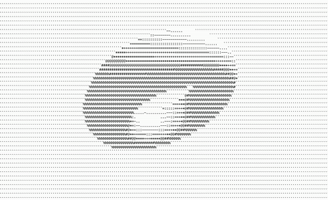

# ASCII 3D Rendering Engine
## For coding beginners
### in pure C!

A version of the final output can be found in the `final` directory but due
to some (intentional) naming conflicts copy and pasting won't work

The lesson plan and pseudocode can be found in the `plan` directory, good for both instructors and attendees

Begin with the `start` directory for starter code.

If you want the ncurses window setup already start from `latecomer` directory

See vec.h for some easy vector math functions.

Could use C++ if desired.

## WINDOWS
Ensure that attendees can get a demo ncurses program on WSL *before* workshop begins!

